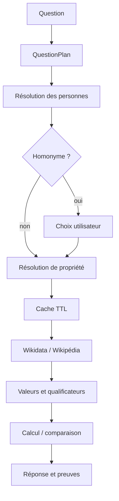

# Architecture de WhoWas V4

## Objectif

WhoWas répond à des questions biographiques sans modèle génératif payant. Chaque réponse
doit être explicable, testable et rattachée à une donnée Wikidata ou Wikipédia.

## Flux principal

## Modules

| Module | Responsabilité |
|---|---|
| `query.py` | produit une action et extrait une ou plusieurs personnes |
| `intents.py` | associe les formulations connues aux propriétés Wikidata |
| `wikidata.py` | appels externes, cache, retries, circuit breaker et formatage |
| `service.py` | orchestration, calculs, comparaisons et génération des réponses |
| `observability.py` | compteurs et exposition Prometheus |
| `rate_limit.py` | limitation de débit en mémoire |
| `main.py` | API, sécurité HTTP, healthchecks et gestion des erreurs |

## Fiabilité

- trois tentatives avec backoff exponentiel sur les erreurs temporaires ;
- huit appels externes simultanés au maximum par processus ;
- circuit ouvert pendant 30 secondes après cinq échecs consécutifs ;
- cache TTL borné à 512 entrées ;
- timeout de connexion de 5 secondes et timeout total de 10 secondes ;
- réponse `503` lorsque la dépendance externe est indisponible.

## Sécurité

- validation Pydantic des entrées ;
- limite de 300 caractères par question ;
- 30 requêtes par minute et par client ;
- CSP et principaux en-têtes de sécurité ;
- création DOM avec `textContent`, sans injection de données externes par `innerHTML` ;
- conteneur exécuté avec un utilisateur non privilégié.

## Limites assumées

Le cache, le rate limiting et les métriques sont locaux à chaque processus. Pour une
exécution distribuée, ils pourraient être remplacés par Redis et un backend Prometheus
adapté au multiprocess. La compréhension reste déterministe : une formulation ambiguë
doit être reformulée plutôt que complétée par une invention.
